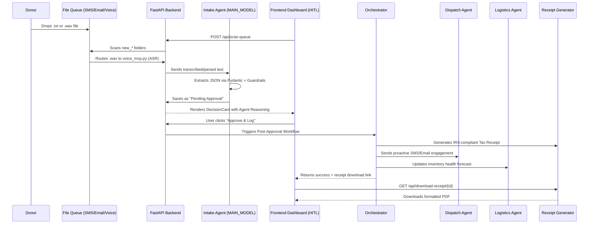
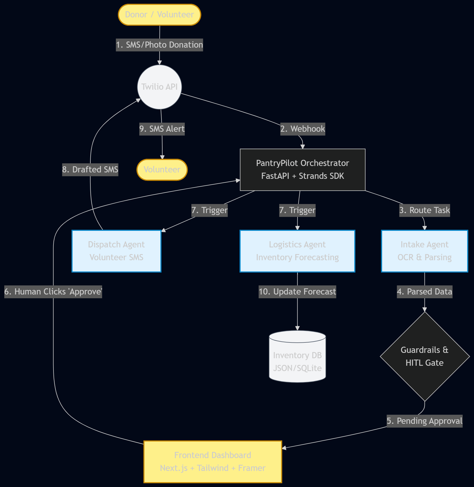

# 📦 PantryPilot

**Autonomous Multi-Agent AI for Food Bank Operations.**

PantryPilot is a production-grade, multi-agent AI orchestration system that automates the entire donation lifecycle for food banks. From unstructured voice notes and text messages to IRS-compliant tax receipts, our AI handles the administrative heavy lifting so food bank staff can focus on feeding their communities.

---

## 🎬 Video Demonstration

> 📺 [Watch the PantryPilot Dashboard in action](#) *(Add your Loom/YouTube link here)*  
> From raw donor message to verified inventory and automated tax receipt in seconds.

---

## ✨ Key Features

- ️ **Multimodal Voice & Text Intake**: Seamlessly processes SMS, Email, and Voice messages. Uses Qwen ASR to transcribe incoming audio and LLMs to parse unstructured text into structured data.
- **Transparent Agentic Workflow**: 
  - **Intake Agent**: Parses donor details, items, quantities, and drop-off times using Pydantic.
  - **Dispatch Agent**: Routes drop-offs to volunteers and sends proactive SMS engagement if donor contact info is missing.
  - **Logistics Agent**: Analyzes incoming inventory to flag shortages and forecast food security.
-  **Human-in-the-Loop (HITL) Approval**: AI never acts blindly. The system presents a clear **"Agent Reasoning"** card detailing exactly what it plans to do. Staff simply click "Approve & Log" to trigger downstream workflows.
- **Automated IRS Tax Receipts**: Upon approval, the system instantly generates a beautifully formatted, IRS-compliant PDF tax receipt, building donor trust and encouraging recurring donations.
-  **Real-Time System Observability**: A live dashboard tracking Total Requests, Success Rates, and Average Latency, alongside full agent tracing and JSONL logging.
-  **Provider-Agnostic Architecture**: All AI models and endpoints are abstracted behind `MAIN_*`, `ASR_*`, and `TTS_*` environment variables, allowing seamless swapping between Qwen, OpenAI, or AWS Bedrock without code changes.

---

## ️🏗️ Architecture & Workflow

1. **Ingestion**: Files (`.txt` for SMS/Email, `.wav` for Voice) are dropped into the backend queue folders (`new_*`).
2. **Transcription & Parsing**: The Queue Processor triggers the ASR API for voice files. The Intake Agent (powered by the Main LLM) extracts structured data and applies safety guardrails.
3. **HITL Review**: The frontend displays the parsed donation with an "Awaiting Approval" status and transparent agent reasoning.
4. **Execution**: Upon clicking "Approve", the Orchestrator triggers:
   - The **Dispatch Agent** (sends proactive SMS/Email).
   - The **Logistics Agent** (updates inventory health).
   - The **Receipt Generator** (creates a PDF via `fpdf2`).
5. **Download**: The user clicks "Download Receipt" to instantly fetch the generated, compliant PDF.

---

## 📁 Project Structure

```text
pantry-pilot/
│
├── backend/                            # Core Python FastAPI Application
│   ├── .venv/                          # Local Python virtual environment
│   ├── agents/                         # Multi-Agent AI Orchestration
│   │   ├── __init__.py
│   │   ├── intake_agent.py             # Parses raw messages into structured data (Pydantic)
│   │   ├── dispatch_agent.py           # Handles volunteer routing & proactive donor SMS/Email
│   │   ├── logistics_agent.py          # Analyzes inventory health and flags shortages
│   │   └── orchestrator.py             # Central state manager enforcing Human-in-the-Loop (HITL)
│   ├── tools/                          # MCP-style utility tools for the agents
│   │   ├── __init__.py
│   │   ├── file_queue.py               # Scans and processes new_* folders (SMS → Email → Voice)
│   │   ├── voice_mcp.py                # ASR transcription tool (qwen3-asr-flash)
│   │   ├── email_mcp.py                # Email dispatch utility
│   │   ├── twilio_mcp.py               # SMS dispatch utility
│   │   ├── ocr_mcp.py                  # (Optional) OCR tool for image-based donations
│   │   ├── receipt_generator.py        # Generates IRS-compliant PDF tax receipts (fpdf2)
│   │   └── inventory_db.py             # Persistent storage and retrieval for donation records
│   ├── utils/                          # Cross-cutting concerns and infrastructure
│   │   ├── guardrails.py               # Input safety & financial hallucination prevention
│   │   ├── logger.py                   # Structured JSONL logging (agent_activity.jsonl)
│   │   ├── metrics.py                  # Real-time performance tracking (latency, success rate)
│   │   └── tracing.py                  # Distributed request tracing for observability
│   ├── state/                          # State management
│   │   └── memory.py                   # Donor interaction history and context retention
│   ├── scripts/                        # Standalone utility scripts
│   │   ├── generate_voice.py           # TTS utility (cosyvoice-v3-flash) to generate demo .wav files
│   │   └── reset_queue.py              # Clears processed folders for fresh demo runs
│   ├── received_messages/              # File-based durable queue system (email/, sms/, voice/)
│   ├── generated_receipts/             # Output directory for approved PDF tax receipts
│   ├── logs/                           # Persistent log storage
│   │   └── agent_activity.jsonl        # Append-only log of all agent actions and HITL events
│   ├── docs/                           # Documentation and template assets
│   ├── .env                            # Local environment variables (API keys, model configs)
│   ├── .env.example                    # Template for environment variables
│   ├── .python-version                 # Python version pin (e.g., 3.12)
│   ├── config.py                       # Centralized configuration loading
│   ├── main.py                         # FastAPI entry point and REST API route definitions
│   ├── pyproject.toml                  # Python project metadata and dependency definitions
│   ├── requirements.txt                # Fallback dependency list for standard pip installs
│   └── uv.lock                         # Cryptographically locked dependencies for uv
│
├── frontend/                           # Next.js 16 (Turbopack) Dashboard
│   ├── .next/                          # Next.js build output directory
│   ├── app/                            # Next.js App Router
│   │   ├── api/approve/route.ts        # Backend API proxy for donation approval
│   │   ├── approvals/[id]/page.tsx     # Individual donation detail page (if applicable)
│   │   ├── globals.css                 # Global Tailwind CSS styles
│   │   ├── layout.tsx                  # Root layout wrapper
│   │   └── page.tsx                    # Main dashboard UI (Queue trigger, pending approvals, history)
│   ├── components/                     # Reusable React components
│   │   ├── AgentLog.tsx                # UI component for displaying raw agent activity logs
│   │   ├── DecisionCard.tsx            # HITL approval card with "Agent Reasoning" & PDF download
│   │   ├── DonationHistory.tsx         # List of approved donations with "Download Receipt" buttons
│   │   ├── ObservabilityDashboard.tsx  # Live metrics, traces, and system health visualization
│   │   └── StatusBadge.tsx             # Real-time system state indicator (Idle, Thinking, Awaiting)
│   ├── node_modules/                   # Frontend dependencies
│   ├── next-env.d.ts                   # Next.js TypeScript declarations
│   ├── next.config.js                  # Next.js configuration
│   ├── package.json                    # Frontend dependencies and scripts
│   ├── package-lock.json               # Locked frontend dependencies
│   ├── postcss.config.js               # PostCSS configuration for Tailwind
│   ├── tailwind.config.js              # Tailwind CSS theme and plugin configuration
│   └── tsconfig.json                   # TypeScript compiler options
│
├── .gitignore                          # Git ignore rules (venv, node_modules, .env, .next, etc.)
├── LICENSE                             # Project license (e.g., MIT)
└── README.md                           # Primary project documentation and setup guide
```

---

## ✍️ System Architecture Diagram





---

## 🔄 Workflow Breakdown

Here is how the agents collaborate across the three distinct phases of the pipeline:

### Phase 1: Ingestion & Architecture (The Setup)
1. **User & Queue**: The donor drops a `.txt` or `.wav` file into the `received_messages` directory.
2. **Queue Processor**: The `file_queue.py` script scans the `new_*` folders in order (SMS → Email → Voice), transcribing audio via `voice_mcp.py` if necessary.
3. **Intake Agent**: The raw text is sent to the Main LLM, which uses Pydantic structured outputs to extract donor details, items, and drop-off times, applying safety guardrails.

### Phase 2: Human-in-the-Loop (The Zero-Trust Gate)
4. **Human Approval**: The swarm physically pauses. The UI displays the parsed data, the AI's "Agent Reasoning", and the proposed actions. The human must explicitly click **"Approve & Log"**. If rejected, the donation is discarded.

### Phase 3: Execution & Generation (The Verification)
5. **Orchestrator Execution**: Upon approval, the Orchestrator triggers the Dispatch Agent (for proactive SMS/Email) and the Logistics Agent (for inventory forecasting).
6. **Receipt Generation**: The `receipt_generator.py` tool uses `fpdf2` to dynamically generate an IRS-compliant PDF tax receipt.
7. **Final Output**: The verified donation is logged to the database, and the user can instantly download the formatted PDF receipt.

---

## 📋 Prerequisites

- **Python 3.10+**
- **Node.js 18+**
- **uv** (Recommended Python package manager)
- **Docker Engine / Docker Desktop** (Optional, for future cloud deployment)
- An **API Key** for Aliyun DashScope (Qwen API) or a compatible OpenAI endpoint.

---

## 🛠️ Installation & Setup

### 1. Clone the Repository
```bash
git clone https://github.com/subair99/pantry-pilot.git
cd pantry-pilot
```

### 2. Backend Setup
```bash
cd ../backend

# Option 1: Using uv (Recommended)
# Sync dependencies exactly as pinned in the cryptographically hashed uv.lock
uv sync

# Option 2: Using standard pip (Fallback)
# python -m venv venv
# source venv/bin/activate  # On Windows use: venv\Scripts\activate
# pip install -r requirements.txt

# Configure Environment Variables
cp .env.example .env  # Edit .env with your MAIN_API_KEY, ASR_MODEL, TTS_MODEL, etc.

### 3. Frontend Setup
```bash
# 1. Navigate to the frontend folder (from the root pantry-pilot directory)
cd ../frontend

# 2. Install core Next.js, React, and UI dependencies
npm install next@latest react@latest react-dom@latest lucide-react@latest framer-motion@latest

# 3. Initialize Tailwind CSS configuration files
npx tailwindcss init -p

# 4. Start the Next.js development server
npm run dev
```

##  Usage

### 1. Start the Backend
```bash
cd backend
uv run uvicorn main:app --reload
```

### 2. Start the Frontend
```bash
cd frontend
npm run dev
```

### 3. Run the Demo Flow
1. Open your browser to `http://localhost:3000`.
2. Drop sample files into the queue directories:
   - **SMS:** `backend/received_messages/sms/new_sms/`
   - **Email:** `backend/received_messages/email/new_email/`
   - **Voice:** `backend/received_messages/voice/new_voice/`
3. Click **"Process Queue & Refresh"** on the dashboard.
4. Click **"Approve & Log"** on a donation card, then click **"Download Receipt"** to see the AI-generated PDF!

---

## 🛡️ Security & Guardrails

PantryPilot implements a defense-in-depth security model for non-profit data:

1. **Input Safety Guardrails**: Blocks malicious or inappropriate inputs before they reach the LLM using a multi-layered defense (Normalization → Regex → Semantic LLM).
2. **Financial Hallucination Prevention**: Strictly validates extracted quantities and values against logical bounds to prevent AI from inventing donation amounts.
3. **Zero-Trust HITL Execution**: The Orchestrator physically cannot trigger downstream actions (SMS, inventory updates, receipt generation) without explicit human approval via the UI.
4. **Provider-Agnostic Secrets**: API keys are strictly isolated in `.env` and never hardcoded, allowing secure deployment to any cloud provider.

---

## 🌟 Inspiration & Learnings

### Genesis
The genesis of **PantryPilot** stemmed from observing the operational bottlenecks of local food banks. While AI is often used for consumer-facing chatbots, its potential to automate back-office logistics for non-profits is vastly underutilized. I wanted to build a system that doesn't just "read text," but acts as a reliable, compliant, and transparent administrative partner.

### What I Learned
Building this project was a deep dive into the intersection of LLM orchestration, stateful workflow design, and real-world compliance:
- **Provider-Agnostic Design is Crucial**: By abstracting `MAIN_*`, `ASR_*`, and `TTS_*` variables, the system became instantly portable. Swapping from Qwen to OpenAI and others with zero code changes.
- **HITL State Management**: Pausing an asynchronous agent workflow for human approval without losing context requires careful state serialization. The orchestrator must maintain a persistent state dictionary that survives UI pauses.
- **Granular Observability**: Tracking metrics at both the macro level (queue scans) and micro level (individual message intake latency) provided enterprise-grade monitoring visibility.

### How I Built It
The project was constructed iteratively across four architectural layers:
1. **Core Queue Engine (`tools/file_queue.py`)**: Built a durable, file-based queue system that acts as a crash-resistant message broker.
2. **Multi-Agent Orchestration (`agents/`)**: Split logic into specialized agents (Intake, Dispatch, Logistics) to reduce context pollution and enable targeted feedback loops.
3. **Mission Control UI (`frontend/`)**: Built a Next.js dashboard with real-time token streaming, interactive approval buttons, and live metrics visualization.
4. **Automated Compliance (`tools/receipt_generator.py`)**: Integrated `fpdf2` to dynamically generate IRS-compliant PDF tax receipts upon human approval.

### Challenges Faced & Solutions

| Challenge | Root Cause | Solution |
| :--- | :--- | :--- |
| **Voice Model Compatibility (418 Error)** | The Qwen CosyVoice API returned `418 InvalidParameter` for several voice names on the international endpoint. | Refactored the script to standardize on the universally supported `longanyang` voice and implemented robust fallback mechanisms. |
| **Safety Guardrail False Positives** | A donor's voice note saying *"we'd hate to throw away perfectly good food"* was blocked because the AI flagged "hate" and "throw away" as toxic. | Refined the guardrail prompts to account for non-profit donation semantics, turning a frustrating bug into a great demo point about domain-specific AI tuning. |
| **Observability Metrics Inflation** | The dashboard initially showed "2 Total Requests" even though 6 messages were processed, because it was only tracking the queue scan endpoint. | Injected `metrics.record_request()` into the per-file processing loop in `file_queue.py`, providing granular, per-message tracking. |

### Final Reflection
Building **PantryPilot** proved that with strict guardrails, transparent HITL workflows, and a decoupled architecture, LLMs can be elevated from creative typists to reliable, compliant engineering partners. It is not just an AI demo; it is a blueprint for how non-profits can leverage multimodal AI to maximize their impact.

---

## 🤖 AI Tools Leveraged

- **Qwen (Tongyi Qianwen)**: The core LLM driving structured extraction (`qwen3.7-plus` or equivalent).
- **Qwen ASR (`qwen3-asr-flash`)**: High-accuracy, multimodal speech-to-text transcription.
- **Qwen CosyVoice (`cosyvoice-v3-flash`)**: High-fidelity text-to-speech for generating realistic demo voice notes.
- **Alibaba Cloud DashScope**: The cloud API infrastructure hosting the Qwen model inference.
- **OpenAI Python SDK**: The standardized client wrapper for seamless, provider-agnostic API calls.

---

## 🛠️ Built With

### Core Tech Stack


### AI & Multi-Agent Architecture


### Security, Testing & DevOps


---

## 📜 License

This project is provided as-is under the **MIT License** for educational and development purposes. See the [LICENSE](LICENSE) file for details.

---

*Built by [AbdulKabir Subair](https://github.com/subair99)*